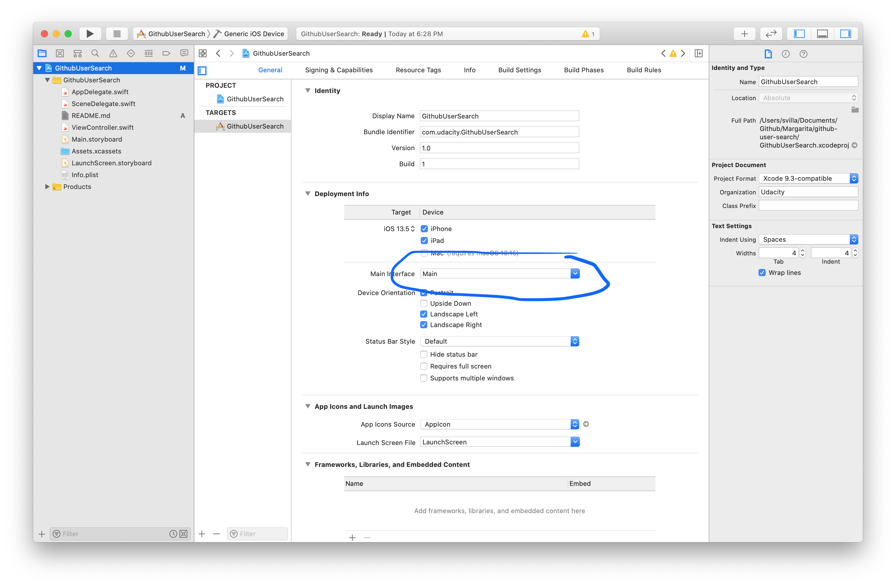

# Becoming a better iOS Developer

1. Delete Main.storyboard
2. Tap the blue project file at the top 'GithubUserSearch'  select the first target called 'GithubUserSearch' under General you should see Main Interface under Deployment Info you need to delete the word Main
3. 
4. In ViewController.swift set the background color of the view property in viewdidload to orange
5. Follow the stack over flow post to modify SceneDelegate.swift so that you're no longer using storyboards
6. Your goal will be to load an instance of ViewController.swift by making window.rootViewController = ViewController()
7. [stackoverflow] (https://stackoverflow.com/a/55882299)
